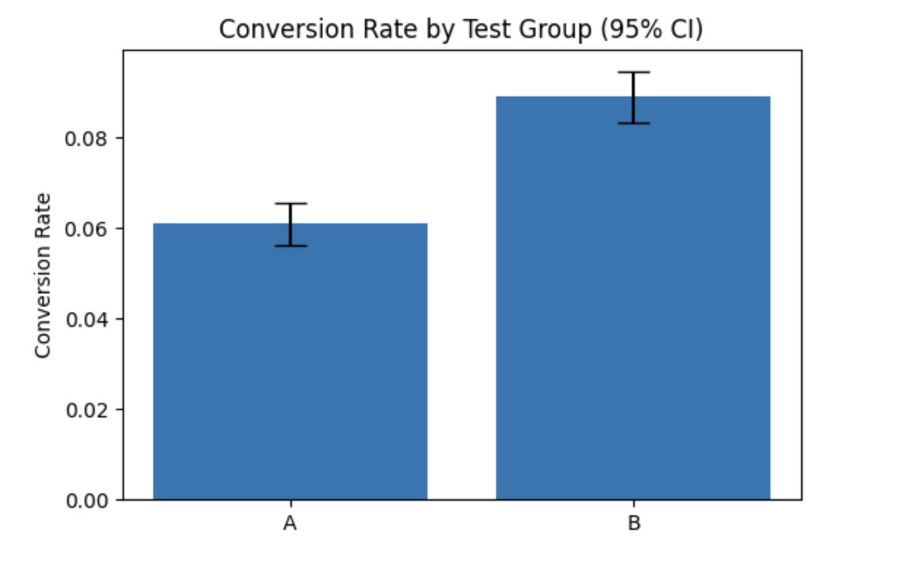
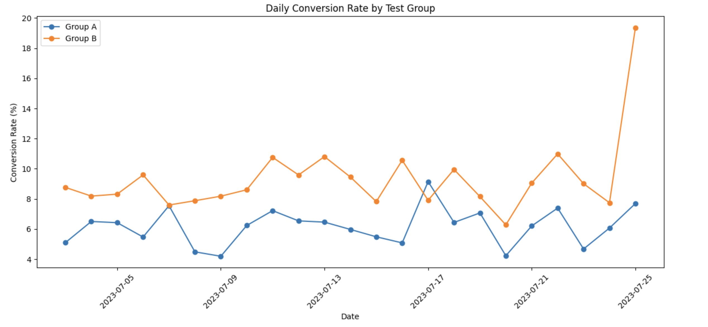

# A/B Test Analysis: Impact of a 50% Discount Message on Subscription Conversion

## Project Overview

This project analyzes an A/B test designed to evaluate whether highlighting a **50% discount** increases subscription purchases.

### Experiment Design

* **Group A (Control):** Standard subscription offer priced at $4.99.
* **Group B (Treatment):** Same subscription offer with an additional 50% discount message.

The primary metric used for evaluation was the **Install-to-Payment Conversion Rate**.

---

## Dataset

The dataset contains user-level information, including:

* User ID
* Timestamp
* Test Group (A/B)
* Conversion Outcome (0/1)

**Test period:** July 3, 2023 – July 25, 2023

**Duration:** 21 days

**Total users:** 19,998

---

## Tools & Technologies

* Python
* Pandas
* NumPy
* Statsmodels
* Matplotlib
* Google Colab

---

## Statistical Method

To compare conversion rates between the two groups, a **Two-Proportion Z-Test** was performed.

### Hypotheses

**H0:** Conversion rates are equal in groups A and B.

**H1:** Conversion rates differ between groups A and B.

---

## Results

| Group |  Users | Conversions | Conversion Rate |
| ----- | -----: | ----------: | --------------: |
| A     | 10,013 |         611 |           6.10% |
| B     |  9,985 |         889 |           8.90% |

### Statistical Test Results

* Z-statistic = -7.52
* p-value = 5.49 × 10⁻¹⁴

Since the p-value is significantly below 0.05, the null hypothesis was rejected.

---

## Visualizations

### Conversion Rate Comparison

### Conversion Trend Over Time

---

## Key Findings

* Group B achieved a higher conversion rate than Group A.
* The observed difference was statistically significant.
* The discount message had a positive impact on subscription purchases.
* Group B consistently outperformed Group A throughout most of the experiment period.

---

## Conclusion

The experiment demonstrated that adding a 50% discount message significantly increased subscription conversion.

Based on the results, **Variant B is recommended for implementation**, as it achieved a substantially higher conversion rate and demonstrated a statistically significant improvement over the control group.

---

## Repository Contents

* `ab_test_analysis.ipynb` - complete analysis notebook
* `ab_test_data.csv` - dataset used in the analysis
* `conversion_comparison.png` — conversion rate comparison with 95% confidence intervals
* `conversion_trend.png` — daily conversion trend by test group
* `README.md` — project documentation
